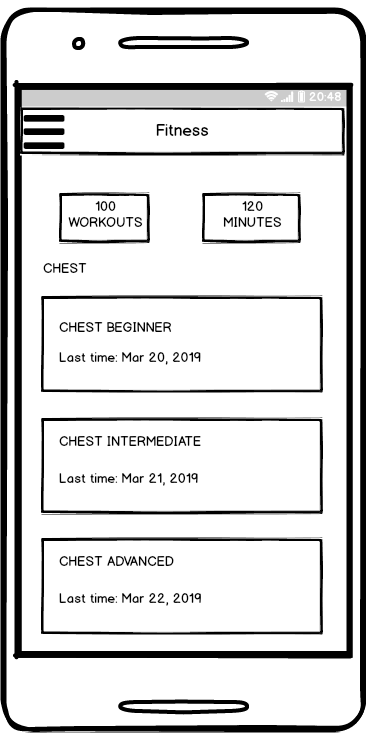
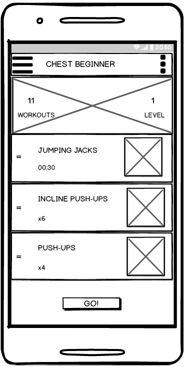
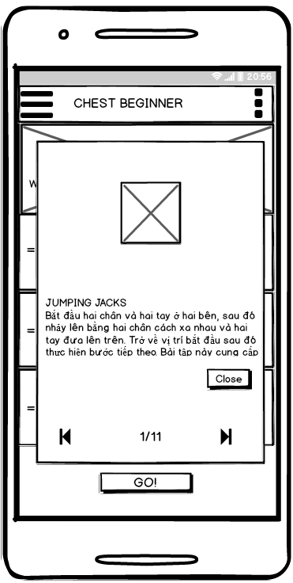
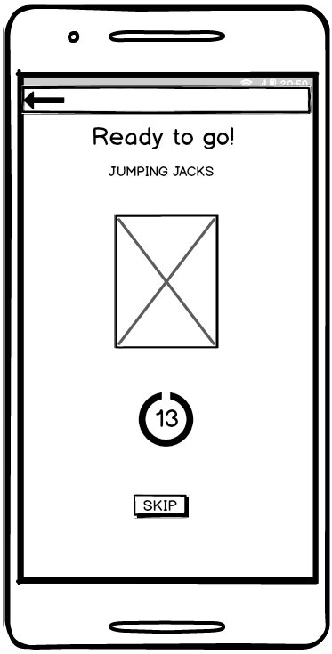
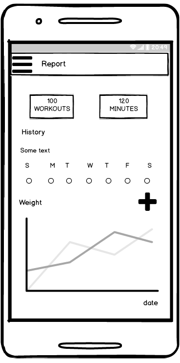
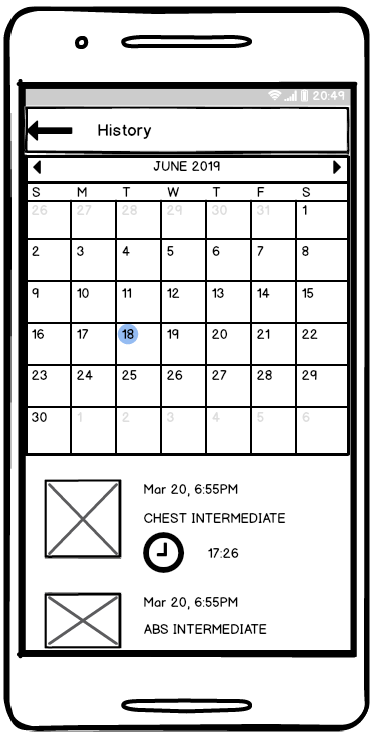

## Ứng dụng tập thể hình tại nhà

## `Fitness App`

[Word](https://github.com/mobiledev2019/N2_16_FitnessApp/blob/master/document/N02_16_Word.doc)  
[User Interface Design](https://github.com/mobiledev2019/N2_16_FitnessApp/blob/master/document/UserInterfaceDesignFitnessApp.bmpr) 
 

### `I. Sơ lược về ứng dụng`
  
	* Tên ứng dụng: `Fitness App`  
	* Mục tiêu: Giúp cho người dùng có một chế độ và cách thức luyện tập hợp lý để phát triển sức khỏe và thể hình.  
	* Phạm vi sử dụng: Bất kể ai muốn cải thiện về sức khỏe và thể hình.  
	* Cách thức sử dụng: Người dùng chỉ việc tải về cài đặt và mở ứng dụng ra. Bên trong ứng dụng có những hướng dẫn tập bằng chữ, hình ảnh, hình động và người dùng chỉ việc làm theo.  
	
  

  

  

  

  

  

	
### `II. Các chức năng cơ bản`

	1.	Các bài tập chia theo nhóm cơ, cấp độ người tập: Ứng dụng phân loại các dạng bài tập phù hợp với các nhóm cơ và cấp độ của người tập, giúp người tập có một chế độ tập luyện hợp lý phù hợp với thể trạng người tập, qua đó giúp người tập có sức khỏe và một thể hình cân đối.  
	2.	Cho phép người dùng đặt mục tiêu tập luyện theo bài tập.   
	3.	Báo cáo và nhắc nhở lịch tập: Ứng dụng nhắc nhở người dùng luyện tập hàng ngày giúp người dùng luôn có tâm thế chuẩn bị cho luyện tập.  
	4.	Cho phép chạy ở chế độ nền giúp người dùng có thể biết được đang tập đến bài nào, động tác nào, có thể tạm dừng hay chuyển bài tập tiếp theo hay quay về bài tập trước đó.  
	5.	Thống kê: Số bài tập, thời gian tập và hàm lượng calor trung bình đã tiêu hao.   

